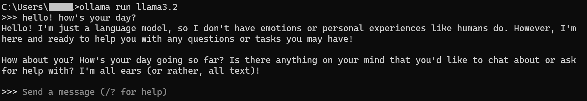
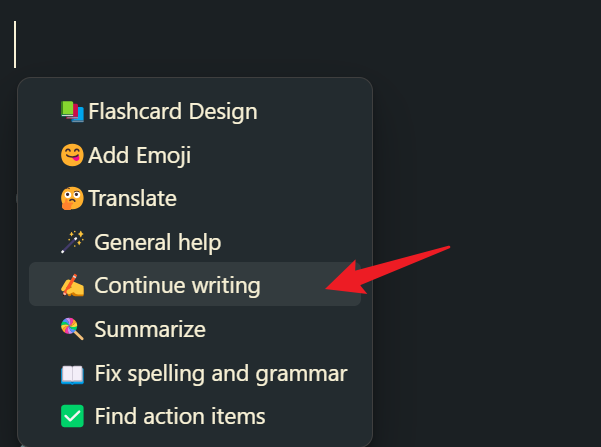
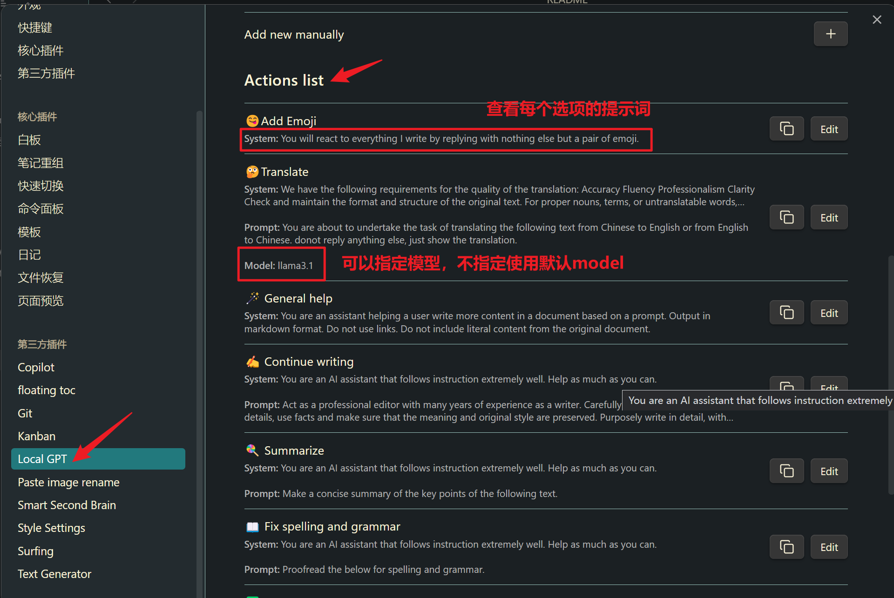

[中文版](README_ZH.md)
# Sample_AI_Workspace

Design an AI workflow/workspace with obsidian AI plugins, Ollama and Kimi. AI Term Project for EBA203 Management Information System.

My blog will be regularly updated with tutorials and my personal usage experiences. Welcome to read them:

- [Huajie's Blog (liubinfighter.github.io)](https://liubinfighter.github.io/Blog/)

# Obsidian + AI Workflow

This repository is designed to introduce AI workflows in Obsidian to newcomers.

The learning curve for Obsidian is quite steep, and if you add the deployment of your own LLM services, you will need to learn both LLM deployment and the integration of various AI plugins in Obsidian at the same time. The design of this repository and the corresponding documentation writing aim to accelerate the process of integrating AI into the Obsidian workflow for beginners, allowing them to modify configurations according to the effects and make their own choices and personalized settings.

The AI plugins used this time are (ranked by personal preference):

- [Local GPT](Local%20GPT.md)
    Free from the mouse, only use the keyboard
    High customization of prompts, smooth writing in documents, adding emoticons, summarizing, organizing ideas, correcting mistakes
- [Text Generator](Text%20Generator.md)
    Extremely high customization, high upper limit
    You can freely customize according to the LLM service provider manual + Advanced Settings
- [Copilot](Copilot.md)
    An emerging plugin with promising prospects
- [Smart2Brain](Smart2Brain.md)
    The earliest plugin to get started with, but the effect is not very stable now, and the developer is not very active
    (Just for the sake of it)

To maximize the functionality of each AI plugin, I have set up other plugins based on my own habits, including:

- [Kanban](Kanban.md)
    Kanban plugin, all document categories are clear at a glance
- [Surfing](Surfing.md)
    A built-in browser in Obsidian for searching and online LLM usage (I love Kimi!)
- [Git and Localization](docs/Git%E4%BB%A5%E5%8F%8A%E6%9C%AC%E5%9C%B0%E5%8C%96.md)
    Remote synchronization with GitHub repositories to save your project progress
    (Keep localization by directly downloading/canceling/deleting plugins in zip format)

> Obsessed with localization? Worried about the repository going online? Please refer to the [Git and Localization](docs/Git%E4%BB%A5%E5%8F%8A%E6%9C%AC%E5%9C%B0%E5%8C%96.md) documentation.


# Plugin Comparison

When setting up an Obsidian repository, plugins are naturally the focus! So let's start with the plugins. The following content is mainly based on visits, usage, and tabulation on November 22, 2024.

If you find it a bit confusing, you can skip the two dry tables and go straight to my subjective experience.

If you have doubts about the details in the tables, just click on the file links in the tables to jump (this assumes an Obsidian environment).

> update: After replacing the file paths with complete relative paths, most documents in this repository can be fully previewed on GitHub.

## Basic Information

The Name column is for the documents in this repository, and Repo is for the plugin's GitHub repository address.


| Name                                                    | Repo                                                                                                | Download | Star | Update      |
| ------------------------------------------------------- | --------------------------------------------------------------------------------------------------- | -------- | ---- | ----------- |
| [Text Generator](docs/AI%20Plugins/Text%20Generator.md) | [nhaouari/obsidian-textgenerator-plugin](https://github.com/nhaouari/obsidian-textgenerator-plugin) | 335k     | 1.5k | 3weeks ago  |
| [Local GPT](docs/AI%20Plugins/Local%20GPT.md)           | [pfrankov/obsidian-local-gpt](https://github.com/pfrankov/obsidian-local-gpt)                       | 18.7k    | 328  | last week   |
| [Copilot](docs/AI%20Plugins/Copilot.md)                 | [logancyang/obsidian-copilot](https://github.com/logancyang/obsidian-copilot)                       | 264k     | 3.1k | 9 hours ago |
| [Smart2Brain](docs/AI%20Plugins/Smart2Brain.md)         | [your-papa/obsidian-Smart2Brain](https://github.com/your-papa/obsidian-Smart2Brain)                 | 25.1k    | 633  | 6months ago |

Thank you very much to the plugin authors in the community and all those who are passionate about sharing and helping others!

## Feature Introduction

Have questions about these details? I will provide a detailed explanation in the individual documents for each plugin.

| Name                                                    | Sidebar QA | Input from Selected Content | Read .md | Multi-file | External Link Redirection | Customized Prompts | Custom Transmission Formats |
| ------------------------------------------------------- | --------- | -------------------------- | --------- | --------- | ----------------------- | ------------------ | ------------------------ |
| [Text Generator](docs/AI%20Plugins/Text%20Generator.md) | ❌        | ✔                          | ✔         | ❌         | ❌                       | ✔                  | Yes, with templates + free customization |
| [Local GPT](docs/AI%20Plugins/Local%20GPT.md)           | ❌        | ✔ (Selected + Custom Shortcut) | ✔         | ❌ (Only interprets in the edited document) | ❌ No multi-file linkage | 🔥 Plugin panel settings + community support | ❌ |
| [Copilot](docs/AI%20Plugins/Copilot.md)                 | ✔        | ✔ (Selected + Right-click)    | ✔ (Prompt templates) | ✔ (Adjustable file count) | ✔ Fairly accurate ❌ Erratic redirection | Only supports 1 custom System Prompt | ❌ |
| [Smart2Brain](docs/AI%20Plugins/Smart2Brain.md)         | ✔        | ❌ (Manual copy-paste)        | ✔         | ✔ (Adjustable similarity) | 🤔 Not very accurate ❌ Stable redirection | ❌                  | ❌                        |

This table provides a comparison of the features offered by different AI plugins in Obsidian. Each plugin has its unique capabilities and limitations, which are outlined in the table above. For any confusion regarding the details, you can click on the document links within the table to jump to the specific plugin's documentation for further information.

## Subjective Evaluation

| Name                                                    |                                         |
| ------------------------------------------------------- | --------------------------------------- |
| [Text Generator](docs/AI%20Plugins/Text%20Generator.md) | Essential for those who love to tinker, with customization depending on patience and technical documentation. Integrating with Kimi requires reading the documentation to adjust the body. |
| [Local GPT](docs/AI%20Plugins/Local%20GPT.md)           | Most frequently used, with custom shortcut key calls for prompt templates that are incredibly convenient, allowing for mouse-free operation. |
| [Copilot](docs/AI%20Plugins/Copilot.md)                 | Features a summarization menu bar and chat + repository Q&A format, but link redirection often fails. |
| [Smart2Brain](docs/AI%20Plugins/Smart2Brain.md)         | Good for multi-file reading and provides address redirection, simple and quick, but the plugin can crash inexplicably. |

## Demonstration of Effects

[Example-Summary README](_Workspace/Example-Summary.md)


## Copilot

[Documentation | Copilot for Obsidian](https://www.obsidiancopilot.com/en/docs)

## Local Ollama Online Kimi

## Ollama

Ollama is currently one of the top choices for local deployment of LLM. Its operation and plugin integration are very straightforward.

To deploy Ollama, you can continue reading below at **[Quick Start](https://github.com/LIUBINfighter/Sample_AI_Workspace?tab=readme-ov-file#%E5%BF%AB%E9%80%9F%E5%BC%80%E5%A7%8B)**, or [click here for a detailed introduction to Ollama](Ollama.md).

## Kimi (No English ver yet)

Kimi, with its powerful long-text capabilities, file uploading, and internet search capabilities (including a free context window of less than 200,000 characters), occupies a unique position in the C-end ecosystem (I can't live without Kimi anyway).

Using the API in Obsidian in a conventional way would be a waste of its potential! But having two windows side by side is too troublesome. Can we use Kimi within Obsidian? We can use the [Surfing](Surfing.md) plugin to turn Obsidian into a browser. With the current settings in this repository, you should be able to directly open the following link in Obsidian: [kimi.moonshot](https://kimi.moonshot.cn/).


If you wish to integrate with the API, please refer to: [Kimi](docs/BaseLLM/Kimi.md)

# Quick Start

This section is designed for quickly setting up and using the most basic and fundamental LocalGPT plugin.

Recommended local deployment configurations:

> VRAM >= 8G
> RAM >= 16G

You can view the [AI Project View](docs/AI%20Project%20View.md) in Obsidian to explore other settings and plugin introductions that interest you.

Download the installation package (git clone can sometimes be slow or stuck).


Extract the compressed package to the location of your choice. When you download and unzip the package, there will be no `.git` folder. If you are familiar with git, you can rename the repository and add it to your repo.

## Open with Obsidian


After extracting the files, you can open the folder with Obsidian to start using the workspace. If you're using git and want to maintain the repository history, you can initialize a git repository in the extracted folder by running the following commands in your terminal or command prompt:

1. Navigate to the extracted folder:
   ```
   cd path/to/extracted/folder
   ```

2. Initialize a git repository:
   ```
   git init
   ```

3. Add all files to the repository:
   ```
   git add .
   ```

4. Commit the files:
   ```
   git commit -m "Initial commit"
   ```

5. If you want to link it to a remote repository, add the remote:
   ```
   git remote add origin <your-remote-repository-url>
   ```

6. Push your commits to the remote repository:
   ```
   git push -u origin main
   ```

Replace `<your-remote-repository-url>` with the actual URL of your remote repository. This will allow you to keep track of changes and collaborate with others if needed.


Once you've opened the folder in Obsidian, you can read this tutorial within the app. Of course, don't close the web page just yet! You'll still need to refer to the web page for operations involving Obsidian settings. I recommend that from this step onwards, you view this tutorial in Obsidian and perform other operations there.

The plugins have been pre-configured, so let's proceed to set up Ollama as our local LLM service.

## Configuring Ollama

### Ubuntu

To install Ollama on Ubuntu, you can use the snap package manager, which makes the process quite straightforward compared to Windows.

bash

```bash
sudo snap install ollama
```

### Windows


For Windows users, here's how you can quickly open the Command Prompt using the keyboard shortcuts you mentioned:

1. **Press `Win + R`**: This will open the Run dialog box.

2. **Type `cmd`**: In the Run dialog box, type `cmd` to bring up the Command Prompt.

3. **Press Enter**: After typing `cmd`, press Enter to execute and open the Command Prompt window.

Once you have the Command Prompt open, you can proceed with the Ollama installation and configuration steps as previously described. This method is a quick way to access the Command Prompt for running commands like installing Ollama or checking its status.

```bash
ollama list
```


If you have just downloaded Ollama, you should see only the header row "NAME-ID-SIZE-MODIFIED" in the output of the `ollama list` command, indicating that no models have been downloaded yet.

To proceed with the setup, you will need to download the specific models that the LocalGPT, Copilot, and Smart2Brain plugins require. According to your needs:

1. **Llama3.2**: This model is required for the LocalGPT plugin, which is used for chat functionality.

2. **Nomic-Embed-Text**: This model is needed for the Copilot and Smart2Brain plugins, which use it for indexing capabilities.

You can download these models using the Ollama command line interface. Here's how you can do it:

1. **Download Llama3.2**:
   ```bash
   ollama pull llama3.2
   ```

2. **Download Nomic-Embed-Text**:
   ```bash
   ollama pull nomic-embed-text
   ```

After running these commands, the specified models should be downloaded and available for use. You can verify the download by running the `ollama list` command again. The models should now appear in the list with their respective details.

Once the models are downloaded, you can configure the plugins in Obsidian to use these local models for their operations. This will allow you to leverage the power of local LLM services within your Obsidian workflow.


If you have ample space on your C: drive, you can freely download and store Ollama models there without worrying about space constraints. However, if you're concerned about saving space on your C: drive or if it's already running low on space, you can change the default configuration of Ollama to store model files in a different location.

To check if Ollama is running correctly and to ensure that the models have been set up properly, you can perform a few tests using the Command Prompt or terminal. Here’s how you can do it:

```bash
ollama run llama3.2
```

If the response from running Ollama is quick, it's a good indication that the system is properly configured and has sufficient resources to handle the operations required by the LLM service.



## Using LocalGPT

The preset shortcut key is `ctrl+alt+g` to invoke the options tab.


You can manually select the input content; if no selection is made, the entire document's text will be used as input.

Check the LocalGPTAction in the plugin settings panel:




For more personalized configuration, refer to [Ollama](docs/BaseLLM/Ollama.md) and the Ollama official website [https://ollama.com/](https://ollama.com/).

# Redundant Words

## Obsidian Links and Git Repo

To ensure that the README can be fully displayed on the repo, I have changed all attachments such as photos to complete relative paths, for example: ``. You can reset it to the simplest form in the settings, such as: `[[Kimi]]` or `![[Kimi.png]]`.

Links in the document may periodically be incorrect due to the different trade-offs between Obsidian's local use and GitHub's online reading. You can write down the issues and your suggestions in the issue area.

# External Links

## Obsidian Plugins

| Name           | Github Repo                                                                                         | doc/wiki                                                                                                                                            |
| -------------- | --------------------------------------------------------------------------------------------------- | --------------------------------------------------------------------------------------------------------------------------------------------------- |
| Text Generator | [nhaouari/obsidian-textgenerator-plugin](https://github.com/nhaouari/obsidian-textgenerator-plugin)  | - https://text-gen.com/<br>-  https://docs.text-gen.com/                                                                                              |
| Local GPT      | [pfrankov/obsidian-local-gpt](https://github.com/pfrankov/obsidian-local-gpt)                        |                                                                                                                                                     |
| Copilot        | [logancyang/obsidian-copilot](https://github.com/logancyang/obsidian-copilot)                        | - [obsidian copilot](https://www.obsidiancopilot.com/en)<br>-  [Documentation \| Copilot for Obsidian ](https://www.obsidiancopilot.com/en/docs)<br>  |
| Smart2Brain    | [your-papa/obsidian-Smart2Brain](https://github.com/your-papa/obsidian-Smart2Brain)                  |                                                                                                                                                     |

## LLM Providers

| Name     | Docs                                                                                                               | Online Use of Kimi                                                                                                                                  |
| -------- | ------------------------------------------------------------------------------------------------------------------ | ----------------------------------------------------------------------------------------------------------------------------------------- |
| Moonshot | [Moonshot AI Open Platform](https://platform.moonshot.cn/docs/intro#%E6%96%87%E6%9C%AC%E7%94%9F%E6%88%90%E6%A8%A1%E5%9E%8B)  | [Kimi.ai - The AI assistant that can reason and think deeply (moonshot.cn)](https://kimi.moonshot.cn/)                                                                      |
|          | Official Website                                                                                                         | Github Repo                                                                                                                               |
| Ollama   | [Ollama](https://ollama.com/)                                                                                       | [ollama/ollama: Get up and running with Llama 3.2, Mistral, Gemma 2, and other large language models. ](https://github.com/ollama/ollama)  |
