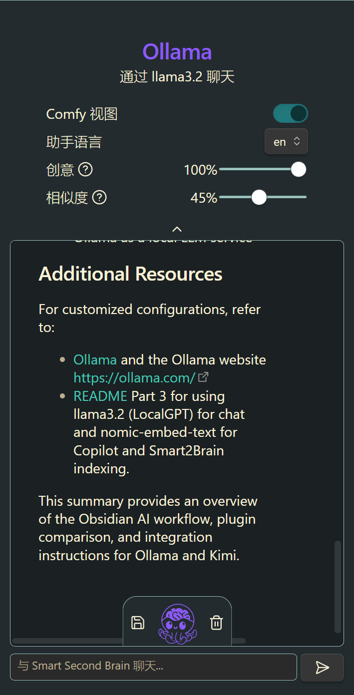
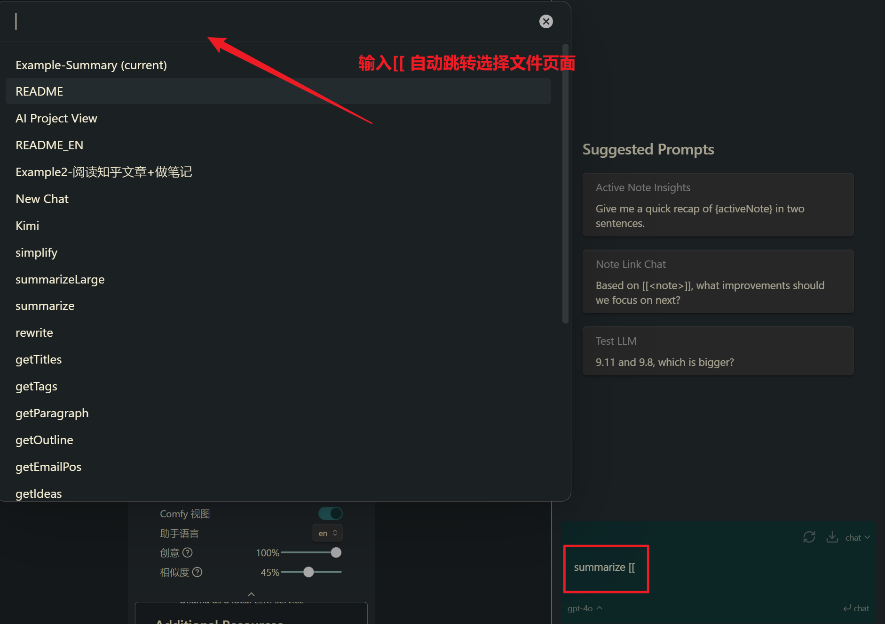
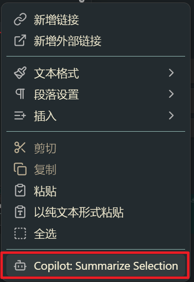

效果供参考

任务选择为概括[README](../README.md)文件。

均使用ollama， llama3.2模型，为了目录顺序不被打乱，我将自带markdown格式的标题都添加了更多的`#`号。

我其实挺好奇这些插件各自的运作方式，同一个模型在不同的插件下输出有非常大的的区别hhh


## 太长不看版
### Text Generator

- **功能**：允许用户基于输入提示生成文本。
- **特点**：当出现错误时，会输出包含错误信息的块。
- **触发方式**：使用快捷键`ctrl+j`。
- **输出**：

### Local GPT

- **功能**：使用本地GPT模型进行写作辅助。
- **特点**：提供了一个简洁的摘要，包括Obsidian知识管理工具AI项目的介绍、AI插件的展示、插件比较表、自定义选项和使用示例。
- **触发方式**：通过快捷键`ctrl+alt+g`调出菜单，使用箭头选择并回车。
- **输出**：

### Smart2Brain

- **功能**：一个较旧的插件，性能和自定义选项较少。
- **特点**：具有独立的边栏（sidebar）。
- **触发方式**：通过提示词`summarize[README](README.md)`。
- **输出**：

### Copilot

- **功能**：与Obsidian插件生态系统集成，提供更准确的结果，但自定义选项有限。
- **特点**：具有独立的边栏（sidebar），并且可以呼出文件选择补全页面的功能。
- **触发方式**：在边栏或内联使用。
- **输出**：


## Text Generator

配置：输出Token 2k限制

> 帮我概括一下文档内容。

触发：`ctrl+j`

> [!ai]+ AI
>
> This is a README file for a personal AI project on Obsidian, a knowledge management tool. The author aims to introduce the concept of integrating AI into Obsidian's workflow and provides an overview of their experience with various plugins.
> The repository contains documentation and configuration files for different AI plugins, including:
> 1. Text Generator: allows users to generate text based on input prompts.
> 2. Local GPT: uses a local GPT model for writing assistance.
> 3. Copilot: integrates with the Obsidian plugin ecosystem.
> 4. Smart2Brain: an older plugin that is no longer actively maintained.
> The author also mentions other plugins, such as Kanban and Surfing, which provide additional features like project management and web browsing.
> The README includes:
> 1. A table comparing different AI plugins, including download statistics and update frequencies.
> 2. Information about each plugin's functionality and customization options.
> 3. The author's subjective evaluation of the plugins' effectiveness.
> 4. A demonstration of how to trigger certain actions with keyboard shortcuts (e.g., `ctrl+j` for text summarization).
> Overall, this README provides a comprehensive introduction to Obsidian's AI workflow and offers guidance for users looking to integrate AI into their knowledge management system.

特别：如果出现报错Textgenerator会输出报错块，比如：

> [!failure]- Failure 
>   TypeError: Failed to fetch
>   
>   - plugin:obsidian-textgenerator-plugin:525 iwt
>     plugin:obsidian-textgenerator-plugin:525:8259
>   
>   - iwt.next
>   
>   - plugin:obsidian-textgenerator-plugin:526 PuI
>     plugin:obsidian-textgenerator-plugin:526:155
>   
>   - PuI.next
>   
>   - plugin:obsidian-textgenerator-plugin:526 PYe._streamResponseChunks
>     plugin:obsidian-textgenerator-plugin:526:6143
>   
>   - plugin:obsidian-textgenerator-plugin:526 async PYe._call
>     plugin:obsidian-textgenerator-plugin:526:6567
>   
>   - async Promise.all
>   
>   - plugin:obsidian-textgenerator-plugin:502 async PYe._generate
>     plugin:obsidian-textgenerator-plugin:502:40488
>   
>   - plugin:obsidian-textgenerator-plugin:502 async PYe._generateUncached
>     plugin:obsidian-textgenerator-plugin:502:37972
>   
>   - plugin:obsidian-textgenerator-plugin:502 async PYe.invoke
>     plugin:obsidian-textgenerator-plugin:502:35775
>   
>  

## Local GPT

> 帮我概括一下文档内容。（不要这句话也行,直接选中命令）

触发：

1.`ctrl+alt+g`调出菜单(自行设置)

2.↑↓箭头选中，回车


Here is a concise summary of the key points in the text:

**Introduction**

The text is about an Obsidian knowledge management tool AI project, with instructions for using various plugins to integrate AI into Obsidian's workflow.

**AI Plugins**

The author presents several AI plugins, including:

* Text Generator: allows users to generate text based on input prompts
* Local GPT: uses a local GPT model for writing assistance
* Copilot: integrates with the Obsidian plugin ecosystem
* Smart2Brain: an older plugin that is no longer actively maintained

**Comparison Table**

A table compares the different AI plugins, including download statistics and update frequencies.

**Customization Options**

Each plugin has its own customization options, such as defining input prompts and output formats.

**Usage Examples**

The author provides examples of how to use each plugin, such as using Local GPT for writing assistance or Copilot for generating text based on user input.

**Other Plugins**

The author mentions other plugins that can be used with Obsidian, including Kanban for project management and Surfing for browsing online content.

**Conclusion**

The text concludes by encouraging users to explore the different AI plugins and customization options available in Obsidian.


## Smart 2 Brain 
这个插件有独立边栏（sidebar）


提示词：
```prompt
summarize[README](README.md)
```

**Summary of [[README]]**

The Obsidian AI workflow is designed to integrate with various plugins for writing assistance, research, and organization. The workspace aims to provide an AI-powered environment.

#### Plugin Comparison Table

| Plugin | Edge Case Support | Input Type | File Support | Linking | Customization Options |
| --- | --- | --- | --- | --- | --- |
| Text Generator | High | Complete customization | No | Limited | High |

The plugins include:
* Local GPT: A local LLM model for writing assistance, providing trigger actions with keyboard shortcuts.
* Copilot: A new plugin offering more accurate results, but with limited customization options.
* Smart2Brain: An older plugin with less stable performance and fewer customization options.

#### Ollama and Kimi Integration

Instructions are provided on integrating Ollama and Kimi into the Obsidian workflow:
* Ollama: A local LLM model for writing assistance, offering simple operation and integration with plugins.
* Kimi: A powerful long-text ability and file upload/search ability, accessible through the Surfing plugin.

#### Quick Start Guide

A quick start guide is available for using Local GPT plugins in Obsidian:
* Download and installation instructions
* Configuration instructions for Ollama as a local LLM service

#### Additional Resources

For customized configurations, refer to:
* [Ollama](docs/BaseLLM/Ollama.md) and the Ollama website https://ollama.com/
* [[README]] Part 3 for using llama3.2 (LocalGPT) for chat and nomic-embed-text for Copilot and Smart2Brain indexing.

This summary provides an overview of the Obsidian AI workflow, plugin comparison, and integration instructions for Ollama and Kimi.


##  Copilot 
这个插件有独立边栏（sidebar），也可以使用inline。

相比Smart2Brian，可以呼出文件选择补全页面的功能很赞。



你也可以选中全文然后右键

无需额外设置，中文输出，不知道之前三个插件为什么不能自动转换为中文输出。

但是表格的形式输出有问题，以及不知道为什么输出非常多重复的内容。

> summarize [[README]]

这个README文件是关于如何使用Ollama（一个Local LLM服务）与Copilot、Smart2Brain等插件在Obsidian中进行高效的写作和研究的指南。

**功能介绍**

| Name                                                    | 边栏QA | 选定内容输入        | 阅读<br>.md  | 多文件               | 外链跳转           | 定制提示词                 | 定制传输280](docs/attachment/img/使用Obsidian打开本地仓库)**

**配置Ollama**

#### Windows


`win+r`输入cmd运行enter确定`

```bash
ollama list
```

如果你刚下载Ollama的模型和高效的阅读能力而闻名。它可以在本地和在线之间进行选择）是目前最强大的优势。


我们要使用kimi上，需要先配置好Kimi，或者直接使用Kimi就不太方便了。


```

更多个性化配置参考[Ollama/Ollama.png)

#### 本地 vs 在线

使用本仓库

#### 多余的话

#### Obsidian链接与Git Repo

为了保证README能在repo上完整呈现，我将所有照片等附件改为完整相对路径，例如：

`win+r`输入cmd运行enter确定

输入
```bash
ollama list
```

如果你刚下载Ollama）后，应当只有NAME-ID-SIZE-MODIFIED](docs/attachment/img/DownloadOllama压缩包.png)

我们要使用llama3.2（LocalGPT只需要这个，用于Chat）


如果你C盘空间不多，可能需要修改ollama配置

#### Windows


输入
```bash
ollama list
```


如果你刚下载Ollama，那么应当只有NAME-ID-SIZE-MODIFIED一行，没有其他的模型。

我们要使用llama3.2（LocalGPT只需要这个，用于Chat）以及nomic-embed-text（Copilot和Smart2Brain额外需要用于索引）


我C盘够大，模型随便下。但是如果C盘本来空间不多，可能需要修改ollama配置使得模型文件保存在其他位置。

#### Ubuntu

我们用snap下载Ollama，其他操作和Windows没有太大区别。

```bash
sudo snap install ollama
```

更多个性化配置参考[Ollama](docs/BaseLLM/Ollama.md)以及Ollama官网 https://ollama.com/

#### 本地 vs 在线

本README文件是关于如何使用Ollama（一个Local LLM服务）与Copilot、Smart2Brain等插件在Obsidian中进行高效的写作和研究的指南。

**功能介绍**

| Name                                                    | 边栏QA | 选定内容输入        | 阅读<br>.md  | 多余文件               | 外链跳转           | 定制提示词                 | 定制传输280](docs/attachment/img/使用Obsidian打开本地仓库.png)


打开后你可以在Obsidian里阅读本教程了。当然，别急着关网页！涉及Obsidian设置一类操作的时候还是要看网页！我建议从这一步之后就在Obsidian里查看本教程并进行其他操作。

插件已经预设完成，我们去配置Ollama作为本地LLM服务。

#### 配置Ollama

#### Windows


`win+r`输入cmd运行enter确定

```bash
ollama list
```

如果你刚下载Ollama，那么应当只有NAME-ID-SIZE-MODIFIED一行，没有其他的模型。

我们要使用llama3.2（LocalGPT只需要这个，用于Chat）以及nomic-embed-text（Copilot和Smart2Brain额外需要用于索引）


我C盘够大，模型随便下。但是如果C盘本来空间不多，可能需要修改ollama配置使得模型文件保存在其他位置。

#### Ubuntu

我们用snap下载Ollama，其他操作和Windows没有太大区别。

```bash
sudo snap install ollama
```

更多个性化配置参考[Ollama](docs/BaseLLM/Ollama.md)以及Ollama官网 https://ollama.com/

#### 本地 vs 在线

使用本仓库

#### 多余的话

#### Obsidian链接与Git Repo

为了保证README能在repo上完整呈现，我将所有照片等附件都改为了完整相对路径，例如：``。可在设置中重新设置为最简形式，形如：`[[Kimi]]`或者 `![[Kimi.png]]`

文档中不定期出现链接错误，是由于Obsidian本地使用和github在线阅读之间的取舍不同。你可以在issue区写下问题和你的建议。

