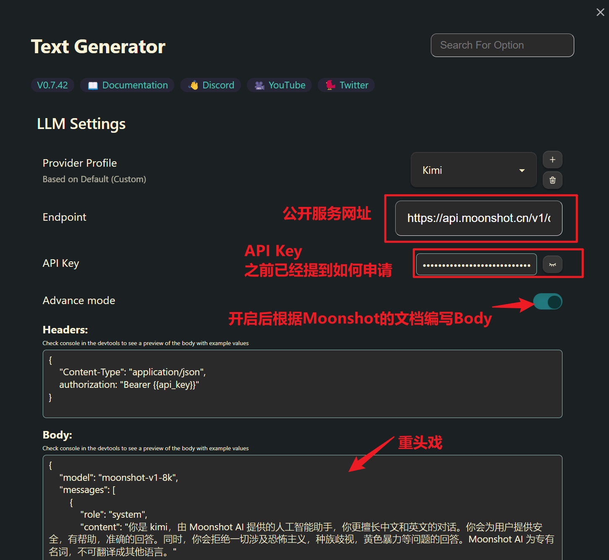

#AI 
虽然本仓库的设置本意是完全本地化AI工作流，但是自行配置以使用在线LLM服务也没有问题。此处以国内的LLM提供商Kimi（月之暗面）为例，配置在线服务。

## API Keys获取

生成API Keys是接入在线LLM服务商的必要步骤。Kimi可以免费生成最多10个API Keys，并且赠送20元免费额度（很香），我们以此为例介绍全流程，其他在线LLM提供商同理。

[点击此页面进入Moonshot AI控制台](https://platform.moonshot.cn/console)

获取密钥后请妥善保存，密钥不会再次显示。如果遗漏则建议删除后新建一个，并修改相应设置。

## 想要满血kimi?

你又想要文档阅读，又想要计算和调用写代码能力，还想联网搜索？

启用插件Surfing在obsidian中直接浏览网页版是没任何门槛的选择！

### Surfing

### API

如果你自己代码能力很强，请看：[chat-completion - Moonshot AI 开放平台](https://platform.moonshot.cn/docs/api/chat#chat-completion)，搭配[Text Generator](../AI%20Plugins/Text%20Generator.md)的Advanced Setting进行编辑。

我的效果如下：

>[!notes]+ User massage
>Kimi，今天中午吃什么？

> [!ai]+ Kimi
>
> 今天中午的菜单可以有很多选择，取决于你的口味和偏好。这里有一些建议：
> 1. **中式快餐**：比如宫保鸡丁、鱼香肉丝、扬州炒饭等。
> 2. **西式简餐**：比如三明治、意面、沙拉等。
> 3. **日式料理**：比如寿司、拉面、便当等。
> 4. **健康轻食**：比如蔬菜沙拉、烤鸡胸肉、全麦面包等。
> 5. **地方特色**：根据你所在的地区，可能会有一些特色美食。
> 如果你想要更具体的建议或者有特定的饮食限制（比如素食、无麸质等），可以告诉我，我可以提供更个性化的建议。或者，如果你想要尝试自己动手做饭，我可以推荐一些简单易做的食谱给你。

配置：

以及比较高级的[工具调用 - Moonshot AI 开放平台](https://platform.moonshot.cn/docs/api/tool_use)。工具链调用还挺难成功了记得踢我。

## Reference

[查看官方文档文档 - Moonshot AI 开放平台](https://platform.moonshot.cn/docs/api/chat)
