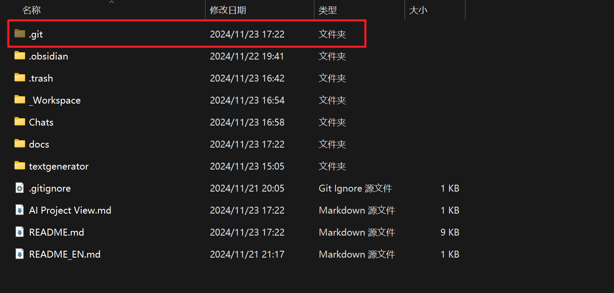
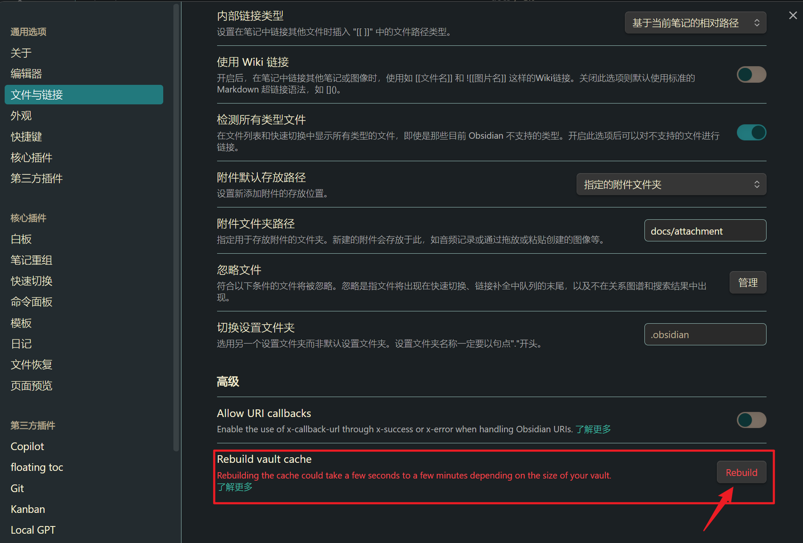

#Infrastructure

本仓库使用git插件同步并推送到github repo。

# 本地 vs 在线

这个仓库已经提供了合适的设置，如果你想要完全本地化隔绝网络可以：

1. 删去.git文件夹（或者下载-main压缩包）以及git插件

![[直接删去git插件.png]]
2. 不使用kimi等在线LLM服务，使用Ollama等本地服务
3. 删去Surfing浏览器插件
4. （可选）重建仓库缓存，去掉之前插件的影响

